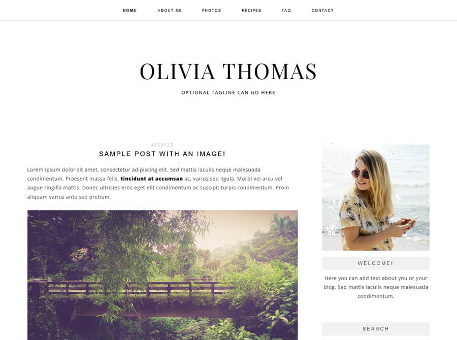

# django_simple_blog

♨️ **Note:** This project was created by MR. Ely and is currently under active development.🍃

## Overview

Django Simple Blog is an easy-to-use blog application built with Django. It simplifies the process of creating and managing a blog, allowing you to focus on your content.

## Usage

1. **Installation:**
   - Clone the repository: `git clone https://github.com/your-username/django_simple_blog.git`
   - Install dependencies: `pip install -r requirements.txt`
   - Set up the database: `python manage.py migrate`
   - Create a superuser account: `python manage.py createsuperuser`
   - Start the server: `python manage.py runserver`

2. **Create Blog Posts:**
   - Log in to the admin panel (http://localhost:8000/admin/).
   - Click "Add Blog Post" to create new articles.

3. **Publish and Manage Posts:**
   - Use the admin panel to easily publish, update, or delete blog posts.

## Features

- User-friendly admin panel for content management.
- WYSIWYG editor for article creation.
- Publishing options, including drafts and scheduling.
- Reader engagement through comments.
- Responsive design for all devices.

## Technologies Used

- Django: Python web framework.
- SQLite: Built-in database.
- HTML, CSS, JavaScript: Front-end technologies.
- Bootstrap: CSS framework for responsive design.

## License

This project is licensed under --- .
